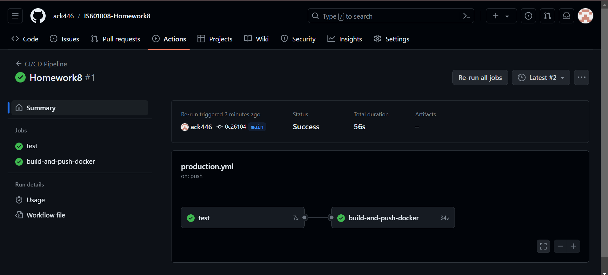
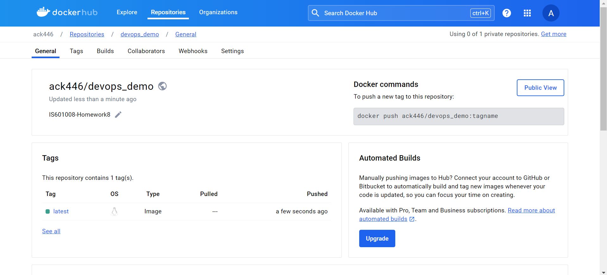

# IS601008-Homework8

## Devops - Automated Builds Pushing to Dockeruhub

## Screenshots

1.  Screenshot of the image in CI/CD Pipeline here.

CI/CD Pipeline : [https://github.com/ack446/IS601008-Homework8/deployments/production](https://github.com/ack446/IS601008-Homework8/deployments/production)

1.  Screenshot of the image in Docker account here.

Docker Hub : [https://hub.docker.com/repository/docker/ack446/devops_demo/general](https://hub.docker.com/repository/docker/ack446/devops_demo/general)

